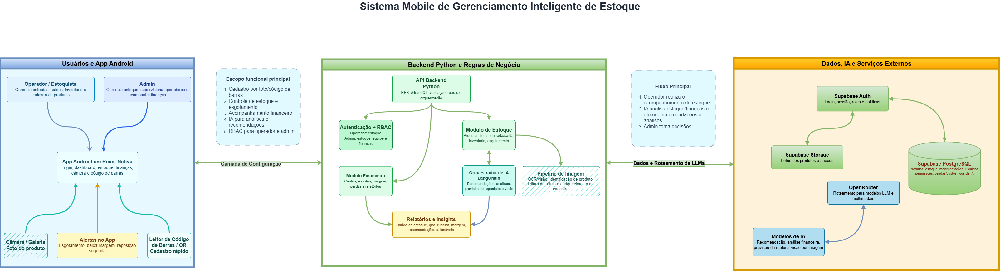

# Stocky

Sistema de gerenciamento inteligente de estoque com IA, desenvolvido para pequenos e médios negócios. Permite controle de produtos, movimentações de estoque, acompanhamento financeiro e recomendações automatizadas via modelos de linguagem.

## Status do POC

| Módulo | Status |
|--------|--------|
| Schema Supabase (produtos, movimentações, lotes, RLS) | ✅ Concluído |
| FastAPI base (`/ping`, `/health`, estrutura) | 🔄 Em progresso |
| Serviço de estoque (CRUD produtos, view `estoque_atual`) | 🔄 Em progresso |
| Agente IA (recomendações + busca web via Tavily) | ✅ Concluído |
| Frontend MVP Streamlit (dashboard, estoque, chat IA) | ✅ Concluído |
| Módulo financeiro | ⏳ Pendente |

## Arquitetura



## Stack

### Frontend (MVP)
| Tecnologia | Uso |
|---|---|
| Streamlit | Dashboard web — visão geral, estoque e chat com IA |

> Frontend mobile (React Native) planejado para após validação do POC.

### Backend
| Tecnologia | Uso |
|---|---|
| Python 3.13 | API REST (FastAPI), regras de negócio e orquestração |
| LangChain + LangGraph | Orquestrador de IA — recomendações, análises e busca web |
| Tavily | Busca web em tempo real para o agente de estoque |
| FastAPI | API REST — endpoints de produtos, movimentações e IA |

### Dados e Infraestrutura
| Tecnologia | Uso |
|---|---|
| Supabase PostgreSQL | Banco principal — produtos, estoque, movimentações, usuários e logs de IA |
| Supabase Auth | Autenticação, sessão e RBAC (Operador / Admin) |
| Supabase Storage | Fotos dos produtos e anexos |
| OpenRouter | Roteamento para modelos LLM e multimodais |

## Funcionalidades (POC)

- Dashboard com KPIs de estoque em tempo real
- Visualização de posição atual com alertas de estoque mínimo
- Chat com agente de IA para consultas e recomendações de reposição
- Agente com acesso à busca web (Tavily) para contexto de mercado
- Serviço CRUD de produtos integrado ao Supabase

## Funcionalidades planejadas (pós-POC)

- Cadastro de produtos por foto (visão computacional) ou código de barras/QR
- Módulo financeiro: custos, receitas, margem e perdas
- Previsão de ruptura por ML
- App mobile React Native
- Controle de acesso por papel: **Operador** (estoque) e **Admin** (estoque + equipe + finanças)

## Como rodar

```bash
# Instalar dependências
uv sync

# Configurar variáveis de ambiente
cp .env.example .env
# Preencher SUPABASE_URL, SUPABASE_ANON_KEY, OPENROUTER_API_KEY, TAVILY_API_KEY

# Aplicar migrations no Supabase
supabase db push --db-url "postgresql://postgres:<senha>@db.<ref>.supabase.co:5432/postgres"

# Rodar Streamlit
uv run streamlit run frontend/app/app.py
```
